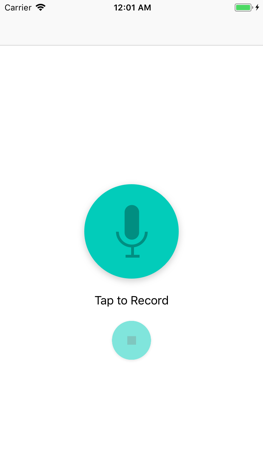
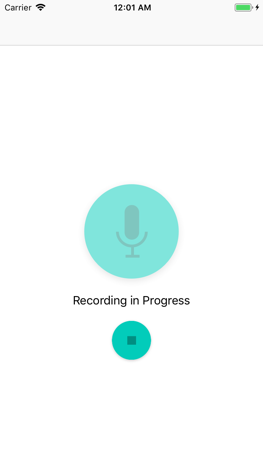
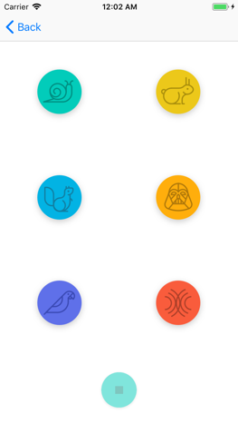
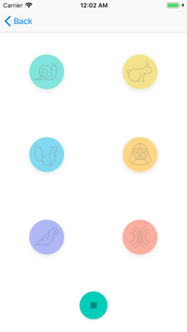

# Pitch Perfect

Records audio and allows the user to playback using one of six settings - slow, fast, high pitch, low pitch, reverb and echo.

## Screenshots

The audio recording and audio playback screens.

Tap to Record | Audio Recording
:--------------------------:|:-------------------------:
|

Audio Playback Options | Audio Playing
:--------------------------:|:-------------------------:
|

## Built With

* [Swift](https://developer.apple.com/swift/) - Programming language for macOS, iOS, watchOS and tvOS. 

## Author(s)

* **Dogak Cinfwat** - *Udacity IOS Nano Degree* exercise.

## License

This project is licensed under the MIT License - see the [LICENSE.md](LICENSE.md) file for details

## Acknowledgments

* Guide from Udacity IOS Nano Degree tutors.
